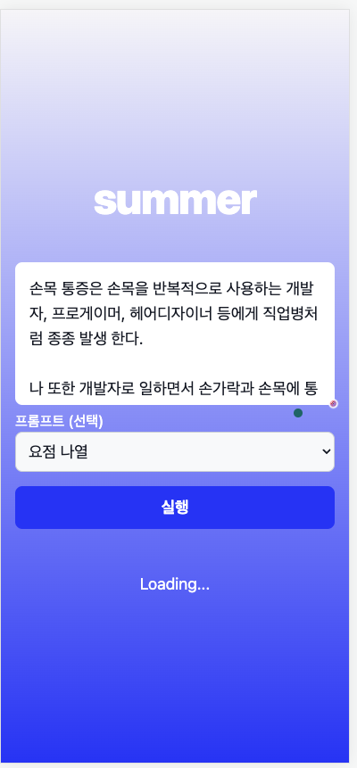

# summer

GPT3 기반 Text Summarizer로 시작된 프롬프트 도우미, 프롬프트를 잘 못짜도 사전에 제작된 템플릿으로 쉽게 GPT3를 이용 할 수 있습니다.

이런식으로 제품화가 진행되겠구나 싶어서 심심풀이로 만들었습니다.

## 어떤 기능이 제공되고 있나요?

* 이어 쓰기
* 요점 나열
* (EN) 문법수정
* (짧게) 요약하기
* (길게) 요약하기
* 글 다시쓰기
* 간단하게 표현하기
* 제목 뽑기
* 트윗 생성
* 반론 생성